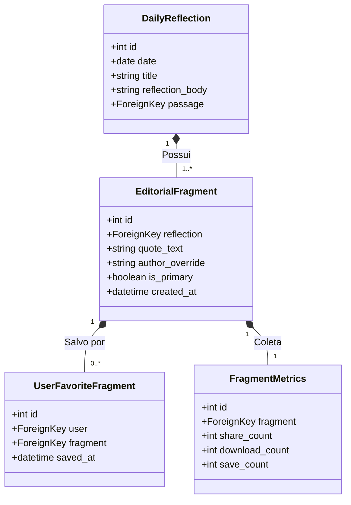

# Arquitetura e Visão do Fragmento Editorial — CAPIO

Este documento detalha o papel estratégico, de design e a evolução arquitetônica do **share_quote** na CAPIO, transicionando-o de um campo simples de banco para um **Ativo Editorial Central** da plataforma de branding contemplativo.

---

## 🏛️ 1. Visão Editorial: O que é o Fragmento?

Na CAPIO, o compartilhamento não serve para gerar viralização frenética ou engajamento ansioso. Ele é uma **extensão da liturgia do silêncio**. 

O fragmento compartilhado (`share_quote`) deve evocar a sensação física de:
* Um trecho sublinhado a lápis em um livro espiritual antigo.
* Uma anotação curta e densa em um diário de recolhimento.
* Uma verdade silenciosa que interrompe o barulho do feed.

### 🚫 O que o Fragmento NÃO É:
* Frases de autoajuda barata ou coaching corporativo.
* Promessas de sucesso financeiro, vitória triunfalista ou jargões gospel tradicionais.
* Legenda enérgica de Instagram com pontos de exclamação ou emojis.

### 🕊️ O que o Fragmento É:
* Focado em **presença, espera, silêncio interior, reverência e descanso na graça**.
* Uma peça minimalista de tipografia impecável e farto respiro visual.

---

## 🔄 2. Relação de Entidades: Do Atual para o Futuro

Atualmente, o `share_quote` é um campo linear de texto em `DailyReflection`. Preparamos a fundação arquitetônica para transicionar este campo a uma entidade autônoma altamente escalável na **Fase 3**.

### Diagrama de Evolução de Domínio (Fase 3)

---

## 🚀 3. Futuras Entidades e Vetores de Evolução

Quando desmembrarmos o fragmento para sua própria tabela, abriremos espaço para os seguintes recursos na plataforma:

### A. `EditorialFragment` (O Fragmento como Classe Própria)
* **Finalidade**: Permitirá cadastrar múltiplos fragmentos por Reflexão Diária, possibilitando rotação aleatória elegante para o usuário, testes A/B de impacto contemplativo, ou overrides autorais históricos (ex: citações de padres do deserto).

### B. `UserFavoriteFragment` (Favoritos e Diário Espiritual)
* **Finalidade**: Um espaço privado e silencioso no perfil do usuário onde ele pode guardar fragmentos que mais tocaram seu coração, criando uma coleção personalizada de meditação para tempos de deserto.

### C. `FragmentMetrics` (Analíticos Contemplativos)
* **Finalidade**: Em vez de curtir, rastrearemos de forma anônima e agregada a taxa de downloads de imagem e compartilhamento do fragmento. O time editorial poderá entender quais temas (espera, reconciliação, deserto) mais ressoam com as dores da comunidade.

### D. Geração Dinâmica de OG Images (OpenGraph)
* **Finalidade**: Cada fragmento gerará uma imagem estática esteticamente perfeita hospedada no servidor. Quando o usuário compartilhar o link da reflexão no WhatsApp, iMessage ou redes sociais, o card de visualização será a própria imagem de livro, atraindo novos usuários pelo silêncio visual do design.

---

## 🛡️ 4. Mitigações e Riscos Operacionais/Editoriais

| Risco | Probabilidade | Impacto | Mitigação Arquitetural |
| :--- | :--- | :--- | :--- |
| **Alinhamento do Claude**: O modelo escapar das regras e gerar frases de coaching ou triufalistas. | Média | Alto | Prompt com regras de ouro repetidas e filtragem estrita via `expected_keys` e validadores de tamanho/exclamação no backend. |
| **Consistência de imagem no download**: Diferença entre o preview na tela e o PNG gerado pelo HTML2Canvas. | Baixa | Médio | Garantir que o canvas do `ShareableCard` use fontes embutidas (Google Fonts) e insets absolutos em pixels, evitando dependência de layouts flexíveis dinâmicos. |
| **Poluição de dados legados**: Reflexões antigas sem `share_quote` quebrando a tela. | Nula | Baixo | Fallback resiliente no React que extrai cirurgicamente a melhor frase do primeiro parágrafo do corpo da reflexão. |
